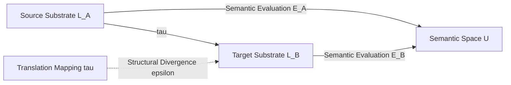

# Cultural Mechanics: Lecture 03
**SEMANTIC MECHANICS PROJECT · MATHEMATICAL LINGUISTICS GROUP**

---

## Lecture 03: Formal Translation
### Computational Geometries and Mathematical Correspondences

- **Course:** Cultural Mechanics
- **Initiative:** The Semantic Mechanics Project
- **Term:** Autumn 2026
- **Prerequisites:** Differential Geometry, Category Theory, Optimal Transport, Linear Algebra
- **Foundational Readings:**
  - Jakobson, Roman (1959). "On linguistic aspects of translation." In R. A. Brower (Ed.), *On Translation*, pp. 232–239. Harvard University Press.
  - Mac Lane, Saunders (1971). *Categories for the Working Mathematician*. Springer-Verlag.
  - Amari, Shun-ichi (2016). *Information Geometry and Its Applications*. Springer Japan.
  - Villani, Cédric (2009). *Optimal Transport: Old and New*. Springer-Verlag.
  - Vaswani, Ashish, et al. (2017). "Attention is all you need." *Advances in Neural Information Processing Systems*, 30, 5998–6008.
  - Quine, Willard Van Orman (1960). *Word and Object*. MIT Press.
- **Compiled Lecture Monograph PDF:** [`lecture_03_formal_translation.pdf`](file:///Users/erickoduniyi/Desktop/mlg/semantic-mechanics/lectures/lecture_03_formal_translation.pdf)
- **Companion Monographs:**
  - [`lecture_01_representational_genealogy.pdf`](file:///Users/erickoduniyi/Desktop/mlg/semantic-mechanics/lectures/lecture_01_representational_genealogy.pdf)
  - [`lecture_02_semantic_inversion.pdf`](file:///Users/erickoduniyi/Desktop/mlg/semantic-mechanics/lectures/lecture_02_semantic_inversion.pdf)

---

## 1. The Translation Problem: Invariance Across Linguistic Substrates

Welcome to *Lecture 03: Formal Translation*. In Lecture 01, we established that formal representations are economic technologies shaped by institutional subsidies and physical media. In Lecture 02, we analyzed how living communities execute algebraic sign inversions ($f \mapsto f^{-1}$) to preserve symbolic autonomy against external appropriation.

We now turn to a foundational question uniting pure mathematics, theoretical linguistics, and high-performance computing: **what does it mean to translate information between distinct formal or natural substrates?**

Historically, translation was treated as a mechanical look-up operation: replacing lexical tokens in a source vocabulary $\mathcal{V}_{\text{src}}$ with tokens in a target vocabulary $\mathcal{V}_{\text{tgt}}$ according to static dictionaries. This naive view collapses under rigorous scrutiny. Natural languages do not partition human experience into identical, isomorphic semantic slices. As Roman Jakobson (1959) established in his structural semiotic taxonomy, translation operates across three distinct planes:

1. **Intralingual Translation (Rewording):** Interpretation of verbal signs via other signs within the same language (e.g., technical glossing, register shifts, paraphrase).
2. **Interlingual Translation (Translation Proper):** Interpretation of verbal signs via signs of another language across distinct phonological and morphosyntactic grammars.
3. **Intersemiotic Translation (Transmutation):** Interpretation of verbal signs via signs of non-verbal sign systems (e.g., text to mathematical notation, musical scores, or visual gestures).



### 1.1 The Fundamental Invariance Postulate of Translation
Let $\mathcal{L}_A$ and $\mathcal{L}_B$ be two formal or natural languages, and let $\mathcal{U}$ be an underlying semantic universe of communicative intent. A translation mapping $\tau: \mathcal{L}_A \to \mathcal{L}_B$ is valid if and only if it preserves an invariant relation $\mathcal{R}$ under semantic evaluation $\mathcal{E}$:

$$\mathcal{R}\Big(\mathcal{E}_A(s), \; \mathcal{E}_B\big(\tau(s)\big)\Big) \le \epsilon \quad \forall s \in \mathcal{L}_A$$

where $\epsilon \ge 0$ measures the bounded semantic distortion or information loss incurred by the structural differences of the target substrate. When $\epsilon = 0$, translation achieves exact semantic isometry. When $\epsilon > 0$, translation encounters the classic tension between **adequacy** (preserving source content) and **fluency** (conforming to target grammatical substrate constraints).

---

## 2. The Differential Geometry of Semantic Manifolds

### 2.1 The Semantic Manifold Hypothesis
Modern representation learning demonstrates that words, phrases, and document sequences do not populate high-dimensional ambient space $\mathbb{R}^d$ uniformly. Instead, linguistic distributions concentrate near low-dimensional, smooth, curved submanifolds $\mathcal{M} \subset \mathbb{R}^d$.

We formalize language as a **Riemannian manifold** $(\mathcal{M}, g)$, where $g$ is a smoothly varying metric tensor assigning an inner product to tangent spaces:

$$g_p: T_p\mathcal{M} \times T_p\mathcal{M} \longrightarrow \mathbb{R}$$

The distance between two concepts $p, q \in \mathcal{M}$ is defined by the **geodesic distance**—the infimum of path lengths along the manifold:

$$d_g(p, q) = \inf_{\gamma} \int_0^1 \sqrt{g_{\gamma(t)}\big(\dot{\gamma}(t), \dot{\gamma}(t)\big)} \, dt, \quad \gamma(0) = p, \; \gamma(1) = q$$

where geodesic trajectories satisfy the Euler-Lagrange equations governed by the Levi-Civita connection $\nabla$:

$$\ddot{\gamma}^k + \Gamma_{ij}^k \dot{\gamma}^i \dot{\gamma}^j = 0, \quad \text{with Christoffel symbols } \Gamma_{ij}^k = \frac{1}{2} g^{kl} \left( \frac{\partial g_{il}}{\partial x^j} + \frac{\partial g_{jl}}{\partial x^i} - \frac{\partial g_{ij}}{\partial x^l} \right)$$

### 2.2 Information Geometry and the Fisher Metric
When a computational model represents semantic tokens through conditional probability distributions $p_\theta(y \mid x)$, the parameter space forms a statistical manifold equipped with the **Fisher Information Metric** (Amari, 2016):

$$g_{ij}(\theta) = \mathbb{E}_{x \sim p_\theta}\left[ \frac{\partial \log p_\theta(x)}{\partial \theta_i} \frac{\partial \log p_\theta(x)}{\partial \theta_j} \right]$$

The Fisher metric defines an intrinsic Riemannian geometry invariant to arbitrary reparameterizations. The Kullback-Leibler divergence between two closely separated parameter states decomposes as the Riemannian quadratic form:

$$D_{\text{KL}}\big(p_\theta \,\|\, p_{\theta + d\theta}\big) = \frac{1}{2} d\theta^T G(\theta) \, d\theta + \mathcal{O}\big(\|d\theta\|^3\big)$$

Translation between two models or two languages corresponds to identifying parameter trajectories along statistical geodesics, minimizing information dissipation across the transition.

### 2.3 Hyperbolic Curvature and Syntactic Hierarchies
Natural languages possess an inherently hierarchical organization: vocabularies branch into hypernymic trees, and sentences decompose into syntactic parse forests. Euclidean geometry $\mathbb{R}^d$ is fundamentally unsuited for embedding trees; preserving tree distances in flat space requires dimensions to scale exponentially.

In contrast, **hyperbolic space** $\mathbb{H}^d$ (characterized by constant negative sectional curvature $K = -1/\zeta^2$) expands exponentially with radius. In the Poincaré ball model $\mathbb{B}^d = \{x \in \mathbb{R}^d : \|x\| < 1\}$, the Riemannian metric is conformally flat:

$$g_x = \lambda_x^2 I_d, \quad \lambda_x = \frac{2}{1 - \|x\|^2}$$

and the geodesic distance between two points $u, v \in \mathbb{B}^d$ is:

$$d_{\mathbb{H}}(u, v) = \text{arcosh}\left( 1 + 2 \frac{\|u - v\|^2}{(1 - \|u\|^2)(1 - \|v\|^2)} \right)$$

By embedding source and target syntactic trees into hyperbolic Riemannian manifolds, translation maps tree hierarchies across languages with minimal distortion ($\epsilon \to 0$).

---

## 3. Continuous Transport Across Languages: From Procrustes to Optimal Transport

### 3.1 The Orthogonal Procrustes Formulation
In computational linguistics, bilingual lexicon induction and cross-lingual transfer can be framed as an alignment of empirical vector clouds. Let $X \in \mathbb{R}^{n \times d}$ and $Y \in \mathbb{R}^{n \times d}$ represent embedding matrices for $n$ corresponding anchor words in the source and target languages, respectively.

If both spaces share an approximately isomorphic relational geometry, translation corresponds to finding an orthogonal rotation matrix $W \in O(d) = \{W \in \mathbb{R}^{d \times d} : W^T W = I_d\}$ solving the **Orthogonal Procrustes Problem**:

$$W^* = \arg\min_{W \in O(d)} \|WX - Y\|_F^2$$

Expanding the Frobenius norm reveals that minimizing distance is equivalent to maximizing trace correlation:

$$\|WX - Y\|_F^2 = \text{Tr}(X^T W^T W X) - 2\,\text{Tr}(Y^T W X) + \text{Tr}(Y^T Y) = \|X\|_F^2 + \|Y\|_F^2 - 2\,\text{Tr}(W X Y^T)$$

The global optimal solution is obtained analytically via the Singular Value Decomposition (SVD) of the cross-covariance matrix $M = X^T Y$:

$$M = U \Sigma V^T \implies W^* = U V^T$$

### 3.2 Wasserstein Geodesics and Monge-Kantorovich Transport
When anchor words are absent or languages exhibit non-linear metric distortion, rigid orthogonal alignment proves insufficient. We generalize translation using **optimal transport theory** (Villani, 2009).

Let $\mu = \sum_{i=1}^n \alpha_i \delta_{x_i}$ and $\nu = \sum_{j=1}^m \beta_j \delta_{y_j}$ be discrete probability measures over the source and target semantic metric spaces $(\mathcal{M}_A, d_A)$ and $(\mathcal{M}_B, d_B)$. The **Wasserstein-1 Distance** (Earth Mover's Distance) computes the minimal work required to transport distribution $\mu$ into $\nu$:

$$\mathcal{W}_1(\mu, \nu) = \inf_{\pi \in \Pi(\mu, \nu)} \sum_{i=1}^n \sum_{j=1}^m \pi_{ij} \, c(x_i, y_j)$$

where $c(x_i, y_j)$ is the cost of transporting unit mass from $x_i$ to $y_j$, and $\Pi(\mu, \nu) = \{\pi \in \mathbb{R}_+^{n \times m} : \pi \mathbf{1}_m = \alpha, \; \pi^T \mathbf{1}_n = \beta\}$ is the transport polytope. In continuous Riemannian settings, the optimal transport map $T: \mathcal{M}_A \to \mathcal{M}_B$ satisfies the non-linear **Monge-Ampère partial differential equation**:

$$\det\big(D^2 \psi(x)\big) = \frac{\rho_A(x)}{\rho_B\big(\nabla\psi(x)\big)}$$

where $\psi: \mathcal{M}_A \to \mathbb{R}$ is a strictly convex potential function whose gradient $\nabla\psi$ pushes the continuous probability density of Language $A$ directly into Language $B$ along volume-preserving geodesics.

### 3.3 Encoder-Decoder Attention as Dynamic Manifold Pushforward
In modern Transformer architectures (Vaswani et al., 2017), translation transcends static vector rotations. The model implements a parameterized, dynamic pushforward mapping via **cross-attention**.

Let $H_{\text{src}} \in \mathbb{R}^{T_{\text{src}} \times d}$ be the contextualized hidden states output by the encoder (representing the source sequence embedded in its manifold). Let $H_{\text{tgt}} \in \mathbb{R}^{T_{\text{tgt}} \times d}$ be the target state representations. The cross-attention mechanism projects query representations from the target space into the key-value representation of the source:

$$Q = H_{\text{tgt}} W_Q, \quad K = H_{\text{src}} W_K, \quad V = H_{\text{src}} W_V$$

$$\text{CrossAttention}(Q, K, V) = \text{softmax}\left(\frac{Q K^T}{\sqrt{d_k}}\right) V$$

Here, the attention matrix $A = \text{softmax}(Q K^T / \sqrt{d_k})$ functions as an empirical, data-dependent coupling matrix $\pi_{ij}$ dynamically routing probability mass from source positions to target positions in real time.

---

## 4. Mathematical Correspondences: Category-Theoretic Translation

### 4.1 Functors as Formal Translation Systems
Translation is not limited to natural languages; it is the fundamental mechanism connecting disparate formal languages in mathematics. In category theory (Mac Lane, 1971), translation is formalized as a **functor** between categories.

Let $\mathcal{C}$ and $\mathcal{D}$ be categories representing formal mathematical systems (e.g., syntax, geometry, or proof theory). A functor $F: \mathcal{C} \to \mathcal{D}$ maps objects $A \in \text{Ob}(\mathcal{C})$ to objects $F(A) \in \text{Ob}(\mathcal{D})$ and morphisms $f: A \to B$ to morphisms $F(f): F(A) \to F(B)$, preserving categorical composition:

$$F(\text{id}_A) = \text{id}_{F(A)}, \quad F(g \circ f) = F(g) \circ F(f) \quad \forall f \in \text{Hom}_{\mathcal{C}}(A, B), \; g \in \text{Hom}_{\mathcal{C}}(B, C)$$

A translation is an **isomorphism of categories** if there exists a functor $G: \mathcal{D} \to \mathcal{C}$ such that $G \circ F \cong \mathbf{1}_{\mathcal{C}}$ and $F \circ G \cong \mathbf{1}_{\mathcal{D}}$. Under categorical equivalence, mathematical truth is invariant to representational dialect.

### 4.2 The Curry-Howard-Lambek Correspondence
The most celebrated formal translation in computational mathematics is the **Curry-Howard-Lambek isomorphism**, which establishes a triadic equivalence between three ostensibly disparate disciplines:

$$\text{\bfseries Intuitionistic Logic} \quad \longleftrightarrow \quad \text{\bfseries Type Theory ($\lambda$-Calculus)} \quad \longleftrightarrow \quad \text{\bfseries Cartesian Closed Categories}$$

| Logic (Proof Theory) | Computation (Type Theory) | Category Theory |
| :--- | :--- | :--- |
| Proposition $A$ | Type $A$ | Object $A$ |
| Proof of Proposition $A$ | Program / Term $t : A$ | Morphism $f : 1 \to A$ |
| Conjunction $A \wedge B$ | Product Type $A \times B$ | Categorical Product $A \times B$ |
| Implication $A \Longrightarrow B$ | Function Type $A \to B$ | Exponential Object $B^A$ |
| Modus Ponens | Function Application | Evaluation Morphism $\text{ev}: B^A \times A \to B$ |
| Proof Normalization | Program Reduction ($\beta$-reduction) | Morphism Simplification |

Under Curry-Howard-Lambek, writing a program is mathematically identical to constructing a logical proof, which is in turn identical to defining a morphism in a category. Translation between these domains is lossless and invertible.

### 4.3 Adjunctions and Galois Connections: The Limits of Exact Translation
When exact isomorphism is unattainable, category theory provides **adjunctions** ($F \dashv G$) to formalize optimal approximation. A functor $F: \mathcal{C} \to \mathcal{D}$ is left adjoint to $G: \mathcal{D} \to \mathcal{C}$ if there exists a natural isomorphism of Hom-sets:

$$\text{Hom}_{\mathcal{D}}\big(F(A), B\big) \cong \text{Hom}_{\mathcal{C}}\big(A, G(B)\big)$$

In partially ordered sets, adjunctions specialize to **Galois connections**. Adjunctions formalize the reality that while translation cannot preserve every nuanced inflection of the source text, it can construct the closest universal approximation within the target language.

---

## 5. The Computational Laboratory: Implementing Manifold Alignment

The computational laboratory for this lecture implements empirical cross-lingual manifold alignment using Singular Value Decomposition on GPU and CPU tensors:

```python
import torch

def orthogonal_procrustes_alignment(X: torch.Tensor, Y: torch.Tensor) -> torch.Tensor:
    """
    Computes the optimal orthogonal rotation matrix W* solving:
        min_W ||WX - Y||_F^2  subject to  W^T W = I
    using Singular Value Decomposition (SVD).
    
    Args:
        X: Source embeddings (N x D)
        Y: Target embeddings (N x D)
    Returns:
        W_star: Optimal orthogonal transformation matrix (D x D)
    """
    # 1. Compute cross-covariance matrix M = X^T Y
    M = torch.matmul(X.t(), Y)

    # 2. Singular Value Decomposition: M = U Sigma V^T
    U, Sigma, Vh = torch.linalg.svd(M, full_matrices=False)

    # 3. Construct optimal orthogonal mapping W* = U V^T
    W_star = torch.matmul(U, Vh)

    # 4. Verify determinant constraint: det(W) = +1 (proper rotation)
    if torch.det(W_star) < 0:
        U_adj = U.clone()
        U_adj[:, -1] *= -1
        W_star = torch.matmul(U_adj, Vh)

    return W_star

def evaluate_manifold_distortion(X: torch.Tensor, Y: torch.Tensor, W: torch.Tensor) -> float:
    """Evaluates relative Frobenius alignment distortion."""
    aligned_X = torch.matmul(X, W)
    error = torch.norm(aligned_X - Y, p='fro') / torch.norm(Y, p='fro')
    return error.item()
```

---

## 6. Seminar Discussion & Socratic Prompts

1. **Curvature Discrepancies Across Natural Languages:** If the syntax of Language A is strictly right-branching (favoring negative curvature $\mathbb{H}^d$) while Language B is non-configurational and non-hierarchical, can an isometric translation map exist without topological tearing?
2. **Isomorphisms vs. Adjunctions in Human Communication:** When an expressive idiom or poetic rhyme is translated between languages, why is the resulting mapping almost always an adjoint functor ($F \dashv G$) rather than a categorical isomorphism ($F \circ G \cong \mathbf{1}$)?
3. **Optimal Transport and Geometric Discrepancy:** In unsupervised machine translation using Wasserstein geodesics, if source and target semantic manifolds are distorted by historical sampling differences, how does optimal transport propagate systematic geometric shifts into translated texts?
4. **Formal Translation in Software Systems:** How does modern compiler intermediate representation (e.g., LLVM IR) embody the Curry-Howard-Lambek correspondence when translating high-level imperative languages into machine instruction sets?

---

## 7. Laboratory Exercise: Hands-On in Jupyter

For this week's laboratory assignment, clone and execute the companion computational notebook:

```bash
notebooks/python/07_cross_lingual_manifold_translation.ipynb
```

### Assignment Tasks:
1. Align bilingual fastText embeddings across English and Yoruba using the closed-form Orthogonal Procrustes algorithm and measure cosine distance preservation.
2. Compute the Wasserstein-1 Earth Mover's Distance between linguistic topic clusters using the Sinkhorn algorithm.
3. Implement a small Poincaré ball hyperbolic projection to evaluate parse-tree distortion under translation.

---

## References

1. Amari, S. (2016). *Information Geometry and Its Applications*. Springer Japan.
2. Jakobson, R. (1959). On linguistic aspects of translation. In R. A. Brower (Ed.), *On Translation* (pp. 232–239). Harvard University Press.
3. Mac Lane, S. (1971). *Categories for the Working Mathematician*. Springer-Verlag.
4. Quine, W. V. O. (1960). *Word and Object*. MIT Press.
5. Vaswani, A., Shazeer, N., Parmar, N., Uszkoreit, J., Jones, L., Gomez, A. N., Kaiser, Ł., & Polosukhin, I. (2017). Attention is all you need. *Advances in Neural Information Processing Systems*, 30, 5998–6008.
6. Villani, C. (2009). *Optimal Transport: Old and New*. Springer-Verlag.
