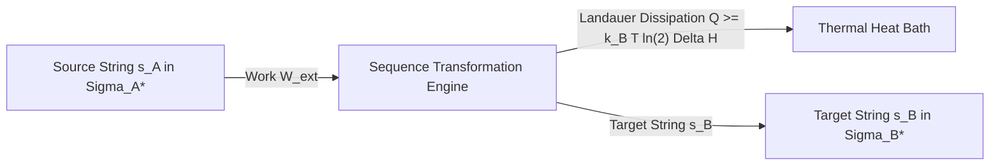

# Cultural Mechanics: Lecture 04
**SEMANTIC MECHANICS PROJECT · MATHEMATICAL LINGUISTICS GROUP**

---

## Lecture 04: Thermodynamic Semiotics
### The Physics of Sequence Transformation and Typographic Work

- **Course:** Cultural Mechanics
- **Initiative:** The Semantic Mechanics Project
- **Term:** Autumn 2026
- **Prerequisites:** Statistical Mechanics, Information Theory, Algorithmic Complexity, Linear Algebra
- **Foundational Readings:**
  - Landauer, Rolf (1961). "Irreversibility and heat generation in the computing process." *IBM Journal of Research and Development*, 5(3), 183–191.
  - Bennett, Charles H. (1973). "Logical reversibility of computation." *IBM Journal of Research and Development*, 17(6), 525–532.
  - Shannon, Claude E. (1948). "A mathematical theory of communication." *Bell System Technical Journal*, 27(3), 379–423.
  - Kolmogorov, Andrei N. (1965). "Three approaches to the quantitative definition of information." *Problems of Information Transmission*, 1(1), 1–7.
  - Bringhurst, Robert (1992). *The Elements of Typographic Style*. Hartley & Marks.
  - Jaynes, Edwin T. (1957). "Information theory and statistical mechanics." *Physical Review*, 106(4), 620–630.
  - Friston, Karl (2010). "The free-energy principle: a unified brain theory?" *Nature Reviews Neuroscience*, 11(2), 127–138.
- **Compiled Lecture Monograph PDF:** [`lecture_04_thermodynamic_semiotics.pdf`](file:///Users/erickoduniyi/Desktop/mlg/semantic-mechanics/lectures/lecture_04_thermodynamic_semiotics.pdf)
- **Companion Monographs:**
  - [`lecture_01_representational_genealogy.pdf`](file:///Users/erickoduniyi/Desktop/mlg/semantic-mechanics/lectures/lecture_01_representational_genealogy.pdf)
  - [`lecture_02_semantic_inversion.pdf`](file:///Users/erickoduniyi/Desktop/mlg/semantic-mechanics/lectures/lecture_02_semantic_inversion.pdf)
  - [`lecture_03_formal_translation.pdf`](file:///Users/erickoduniyi/Desktop/mlg/semantic-mechanics/lectures/lecture_03_formal_translation.pdf)

---

## 1. Thermodynamic Foundations of Semiosis

Welcome to *Lecture 04: Thermodynamic Semiotics*—the second installment of our three-part **Translation Trilogy**. In Lecture 03 (*Formal Translation*), we investigated the differential geometry of continuous semantic manifolds and category-theoretic isomorphisms. Yet every physical intelligence system—from human scribes pressing reeds into Sumerian clay to GPU clusters executing matrix products—is fundamentally a **non-equilibrium thermodynamic engine** bound by physical conservation laws.

Symbols are not disembodied abstractions. A sign is an ordered physical configuration of matter and energy: inked pigments bonded to cellulose fibers, crystalline domain orientations on magnetic platters, or synchronized action potentials traversing biological axons. Transforming a sequence of symbols from a source alphabet $\Sigma_A$ into a target alphabet $\Sigma_B$ requires a measurable expenditure of physical work $\mathcal{W}$ and produces an unavoidable dissipation of entropy $\Delta S$ into the surrounding heat bath.



### 1.1 Landauer's Principle of Information Erasure
In any physical computational substrate operating in thermal equilibrium at temperature $T$, erasing one bit of physical or informational entropy dissipates a strictly positive minimum quantity of thermodynamic energy as heat into the environment:

$$\mathcal{Q}_{\text{diss}} \ge k_B T \ln 2$$

where $k_B = 1.380649 \times 10^{-23} \text{ J}\cdot\text{K}^{-1}$ is Boltzmann's constant. At ambient room temperature ($T = 300\text{ K}$), this fundamental limit evaluates to:

$$\mathcal{Q}_{\text{min}} \approx 2.871 \times 10^{-21} \text{ Joules} \approx 0.0179 \text{ eV}$$

While modern silicon semiconductor chips operate several orders of magnitude above Landauer's bound (typically dissipating $\sim 10^{-17}\text{ J}$ per CMOS gate transition), Landauer's principle establishes an absolute physical law connecting computational logic to thermodynamics: **logical irreversibility implies physical dissipation** (Bennett, 1973).

Whenever a translation mapping $\tau: \Sigma_A^* \to \Sigma_B^*$ is non-injective or compresses semantic state space ($H(\Sigma_A \mid \Sigma_B) > 0$), microscopic degrees of freedom are contracted into fewer macroscopic states. By the Second Law of Thermodynamics, this contraction of information phase space must be compensated by an increase in thermal bath entropy:

$$\Delta S_{\text{bath}} \ge -k_B \int_{\Omega} \rho(x) \ln \rho(x) \, dx = k_B \cdot H_{\text{erased}}$$

---

## 2. Typographic Ergonomics and Stroke Classification

### 2.1 Differential Curvature and Manufacturing Energy of Glyphs
In physical communication, sequences of symbols must be inscribed into a physical spatial medium. A glyph $G$ is mathematically formalized as a collection of continuous planar curves $\gamma_k: [0, 1] \to \mathbb{R}^2$ embedded in a bounded coordinate frame $[0, w] \times [0, h]$.

The physical work required to scribe, engrave, punch-cut, or optically scan a glyph is governed by its **differential curvature energy** and **frictional resistance**:

$$\mathcal{E}_{\text{stroke}}(G) = \sum_{k=1}^{K} \int_0^{L_k} \Big( \alpha + \beta \kappa_k(s)^2 \Big) \, ds$$

where $s$ is the arc-length parameter along the $k$-th stroke, $\kappa(s) = \|\frac{d^2\gamma}{ds^2}\|$ is the local geometric curvature, $L_k$ is the metric stroke length, $\alpha > 0$ represents the basal frictional resistance of dragging a stylus, brush, or raster beam across the substrate, and $\beta > 0$ is the mechanical bending stiffness penalty.

Topologically, character sets exhibit sharp variations in Euler characteristic $\chi = V - E + F$:
- **Genus 0 (Tree Glyphs):** Open curves with no enclosed counter-forms ($\chi = 1$), such as Latin `C, E, I, L, S, T, V, Z`. These require minimal ink-bleed correction and lowest rasterization energy.
- **Genus 1 (Monotoroidal Glyphs):** Single enclosed loop ($\chi = 0$), such as `A, D, O, P, R, Q`. In mechanical punch-cutting, these require internal counter-punches and high manufacturing pressure.
- **Genus 2 (Bitoroidal Glyphs):** Double enclosed loops ($\chi = -1$), such as `B` or `8`.

### 2.2 Visual Classification Entropy and Perceptual Foveation
When human readers or computer vision models inspect an orthographic text, the visual sensor executes rapid ballistic saccades followed by fixed foveations. The energetic cost of identifying a glyph $s \in \Sigma$ is bounded by the **perceptual classification entropy**:

$$\mathcal{H}_{\text{visual}}(\Sigma) = -\sum_{i=1}^{|\Sigma|} P(s_i) \log_2 P(s_i)$$

| Writing System | Alphabet Size ($|\Sigma|$) | Entropy / Glyph | Mean Strokes | Topological Genus |
| :--- | :---: | :---: | :---: | :---: |
| **Latin Alphabet** | $26$ | $\sim 4.70\text{ bits}$ | $2.1\text{ strokes}$ | $0.35$ |
| **Arabic Abjad** | $28$ | $\sim 4.81\text{ bits}$ | $1.8\text{ strokes}$ | $0.28$ |
| **Hangul Featural** | $40$ | $\sim 5.32\text{ bits}$ | $3.4\text{ strokes}$ | $0.45$ |
| **Ge'ez Abugida** | $182$ | $\sim 7.51\text{ bits}$ | $3.8\text{ strokes}$ | $0.40$ |
| **Hanzi Logographs** | $3{,}500+$ | $\sim 11.77\text{ bits}$ | $9.2\text{ strokes}$ | $1.85$ |

Human culture discovers a universal Pareto frontier balancing production and recognition work:

$$\mathcal{W}_{\text{total}} = \sum_{t=1}^N \Big( \mathcal{E}_{\text{stroke}}(s_t) + \lambda \mathcal{H}_{\text{visual}}(s_t) \Big)$$

---

## 3. Algorithmic Information and String Transformations

### 3.1 Kolmogorov Complexity and Minimal Description
Beyond physical ink, the informational content of a symbolic string $s \in \Sigma^*$ is measured by its **Kolmogorov complexity** $K_{\mathcal{U}}(s)$—the length of the shortest computer program $p$ running on a prefix-free universal Turing machine $\mathcal{U}$ that halts and outputs $s$:

$$K_{\mathcal{U}}(s) = \min_{p} \big\{ |p| : \mathcal{U}(p) = s \big\}$$

In sequence translation $\tau: s_A \mapsto s_B$, the **conditional Kolmogorov complexity** $K(s_B \mid s_A)$ quantifies the irreducible computational program required to reconstruct the target string given the source text:

$$K(s_B \mid s_A) \le K(\tau) + \mathcal{O}(1)$$

When translating between structurally isomorphic languages (e.g., Python to JavaScript or Italian to Spanish), $K(s_B \mid s_A)$ is small; the translation program $\tau$ exploits extensive shared grammatical regularities. When translating between distant representational regimes, $K(s_B \mid s_A)$ approaches the full algorithmic entropy of the target sequence.

### 3.2 Edit Distance as Thermodynamic Work
In statistical string physics, converting source string $s_A$ into target string $s_B$ through atomic edit operations defines an editing trajectory $\mathcal{T} = (\sigma_0, \sigma_1, \dots, \sigma_T)$.

The Levenshtein distance $d_L(s_A, s_B)$ corresponds to the **minimum mechanical action** along the optimal transformation path:

$$d_L(s_A, s_B) = \min_{\mathcal{T}} \sum_{t=1}^T c(\sigma_{t-1} \to \sigma_t)$$

Under the **Jarzynski Equality** from non-equilibrium statistical mechanics, the average exponential work expended along stochastic editing trajectories matches the equilibrium free energy difference $\Delta F$:

$$\left\langle \exp\left(-\frac{\mathcal{W}_{\text{edit}}}{k_B T}\right) \right\rangle = \exp\left(-\frac{\Delta F}{k_B T}\right)$$

where $\Delta F = F(s_B) - F(s_A)$ is the difference in algorithmic free energy. When editing strings out of equilibrium, the dissipated work $\mathcal{W}_{\text{diss}} = \langle \mathcal{W} \rangle - \Delta F \ge 0$ measures the thermodynamic inefficiency of the translation channel.

### 3.3 Tokenization Entropy and Vocabulary Cardinality
The choice of vocabulary size $|\mathcal{V}|$ represents a thermodynamic parameter governing memory bandwidth:

$$\mathcal{L}_{\text{seq}} = \frac{N_{\text{chars}}}{\bar{\ell}_{\text{token}}(|\mathcal{V}|)}, \quad H(\mathcal{V}) = \log_2 |\mathcal{V}|$$

Expanding vocabulary size $|\mathcal{V}|$ shortens sequence length $\mathcal{L}_{\text{seq}}$, reducing quadratic attention computations $\mathcal{O}(\mathcal{L}^2)$ in Transformer architectures. However, it increases the parameter footprint of embedding and unembedding matrices $W_{\text{emb}} \in \mathbb{R}^{|\mathcal{V}| \times d}$, increasing memory bus traffic. The optimal vocabulary size $|\mathcal{V}^*|$ minimizes the total energy expenditure across the memory hierarchy.

---

## 4. The Physics of Machine and Human Learning

### 4.1 Free Energy Minimization in Sequence Processing
Following the variational formulation of statistical physics (Jaynes, 1957; Friston, 2010), both biological cognitive circuits and deep sequence models process linguistic strings by minimizing a **Helmholtz Free Energy** functional $\mathcal{F}$:

$$\mathcal{F}(q, y) = \mathbb{E}_{q(\theta)}\big[ E(y, \theta) \big] - T \cdot S\big(q(\theta)\big)$$

where $E(y, \theta) = -\ln p(y, \theta)$ is the internal energy (the cross-entropy sequence prediction loss), $S(q) = -\int q(\theta) \ln q(\theta) d\theta$ is the informational entropy of the parameter distribution, and $T$ is an effective computational temperature.

### 4.2 Langevin Dynamics and Thermal Gradient Noise
During parameter optimization in neural machine translation models, gradient descent updates under stochastic gradient descent (SGD) follow discrete **overdamped Langevin diffusion**:

$$\frac{d\theta}{dt} = -\nabla \mathcal{L}(\theta) + \sqrt{\frac{2 k_B T_{\text{num}}}{\gamma}} \, \xi(t)$$

where $\mathcal{L}(\theta)$ is the empirical sequence loss, $\xi(t)$ is Gaussian white noise satisfying $\langle \xi(t) \xi(t') \rangle = \delta(t - t')$, $\gamma$ is the numerical damping coefficient, and $T_{\text{num}} = \frac{\eta B_{\text{size}}}{2N}$ is the synthetic thermal temperature induced by mini-batch sampling noise with learning rate $\eta$.

### 4.3 Memory Transport and Hardware Thermodynamic Costs
In high-performance computational infrastructure, the thermodynamic cost of processing sequences is dominated not by arithmetic logic units (ALUs), but by **memory transport energy**:

| Hardware Operation | Energy Cost (pJ) | Relative Energy Multiplier |
| :--- | :---: | :---: |
| **32-bit Floating Point Add / Multiply** | $0.9\text{ pJ}$ | $1.0\times$ |
| **SRAM On-Chip Cache Read (32-bit)** | $5.0\text{ pJ}$ | $5.5\times$ |
| **HBM / DRAM Off-Chip Fetch (32-bit)** | $640.0\text{ pJ}$ | $711.1\times$ |
| **Optical Board-to-Board Interconnect** | $1{,}200.0\text{ pJ}$ | $1{,}333.3\times$ |

Moving symbolic tokens across the DRAM memory wall consumes $>700\times$ more energy than executing a mathematical operation.

---

## 5. The Computational Laboratory

```python
import numpy as np

def compute_stroke_curvature_energy(points: np.ndarray, alpha: float = 1.0, beta: float = 2.0) -> float:
    """
    Computes physical stroke bending energy:
        E = integral (alpha + beta * kappa^2) ds
    for a discretized glyph contour (N x 2).
    """
    # 1. Compute first-order differences (tangent arc length)
    dx = np.gradient(points[:, 0])
    dy = np.gradient(points[:, 1])
    ds = np.sqrt(dx**2 + dy**2) + 1e-8

    # 2. Compute second-order differences (curvature acceleration)
    ddx = np.gradient(dx)
    ddy = np.gradient(dy)
    
    # 3. Signed curvature kappa = |dx*ddy - dy*ddx| / (dx^2 + dy^2)^(3/2)
    curvature = np.abs(dx * ddy - dy * ddx) / (ds**3)
    energy = np.sum((alpha + beta * (curvature**2)) * ds)
    return float(energy)

def landauer_dissipation(entropy_erased_bits: float, temp_kelvin: float = 300.0) -> float:
    """
    Computes minimum theoretical thermodynamic dissipation:
        Q >= k_B * T * ln(2) * Delta_H (Joules)
    """
    k_B = 1.380649e-23  # Boltzmann constant in J/K
    q_min = k_B * temp_kelvin * np.log(2) * entropy_erased_bits
    return float(q_min)
```

---

## 6. Seminar Discussion & Socratic Prompts

1. **Thermodynamic Efficiency of Natural Alphabets:** Why did Phoenician, Greek, and Latin alphabets stabilize at roughly 20–30 phonetic symbols rather than expanding to 10,000 ideograms or collapsing to a 2-symbol binary alphabet? What thermodynamic trade-off between stroke manufacturing work and sequence length does this strike?
2. **Reversible Computing and Lossless Translation:** If translation between two formal languages is a category-theoretic isomorphism ($F \circ G \cong \mathbf{1}$), can it theoretically be implemented on Bennett-style logically reversible hardware with zero Landauer dissipation?
3. **The Energy Cost of Hallucination:** In large language models, generating divergent or hallucinated tokens increases sequence entropy. How does this entropy generation manifest in physical power draw across GPU clusters?
4. **Typographic Wear and Historical Media:** How did the physical wear of lead type and mechanical punch-cutting historically constrain the evolution of European font designs (e.g., Blackletter vs. Antiqua)?

---

## 7. Laboratory Exercise

For this week's laboratory assignment, clone and execute the companion computational notebook:
```bash
notebooks/python/08_thermodynamic_semiotics.ipynb
```

### Assignment Tasks:
1. Vectorize TrueType glyph contours across three scripts (Latin, Arabic, and Hanzi) and calculate their mechanical stroke curvature energy $\mathcal{E}_{\text{stroke}}$.
2. Measure empirical Landauer dissipation limits for token sequence translation across varying vocabulary compressions.
3. Implement Langevin dynamic simulation on a 2D synthetic loss landscape to evaluate the role of thermal gradient noise in escaping non-convex saddle points.

---

## References

1. Bennett, C. H. (1973). Logical reversibility of computation. *IBM Journal of Research and Development*, 17(6), 525–532.
2. Bringhurst, R. (1992). *The Elements of Typographic Style*. Hartley & Marks.
3. Friston, K. (2010). The free-energy principle: a unified brain theory? *Nature Reviews Neuroscience*, 11(2), 127–138.
4. Jaynes, E. T. (1957). Information theory and statistical mechanics. *Physical Review*, 106(4), 620–630.
5. Kolmogorov, A. N. (1965). Three approaches to the quantitative definition of information. *Problems of Information Transmission*, 1(1), 1–7.
6. Landauer, R. (1961). Irreversibility and heat generation in the computing process. *IBM Journal of Research and Development*, 5(3), 183–191.
7. Shannon, C. E. (1948). A mathematical theory of communication. *Bell System Technical Journal*, 27(3), 379–423.
