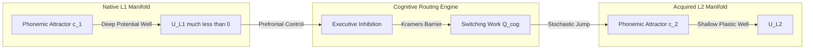

# Cultural Mechanics: Lecture 05
**SEMANTIC MECHANICS PROJECT · MATHEMATICAL LINGUISTICS GROUP**

---

## Lecture 05: Cognitive Translation
### Multilingual Neural Manifolds, Augmentative Communication, and Cross-Modal Dynamics

- **Course:** Cultural Mechanics
- **Initiative:** The Semantic Mechanics Project
- **Term:** Autumn 2026
- **Prerequisites:** Dynamical Systems, Non-Equilibrium Statistical Mechanics, Information Theory, Differential Geometry
- **Foundational Readings:**
  - Chomsky, Noam (1965). *Aspects of the Theory of Syntax*. MIT Press.
  - Levelt, Willem J. (1989). *Speaking: From Intention to Articulation*. MIT Press.
  - Friston, Karl (2010). "The free-energy principle: a unified brain theory?" *Nature Reviews Neuroscience*, 11(2), 127–138.
  - Shannon, Claude E. (1948). "A mathematical theory of communication." *Bell System Technical Journal*, 27(3), 379–423.
  - Light, Janice, & McNaughton, David (2014). "Communicative competence for individuals who require augmentative and alternative communication: A new definition for a new era of communication?" *Augmentative and Alternative Communication*, 30(1), 1–18.
  - Stokoe, William C. (1960). "Sign language structure: An outline of the visual communication systems of the American deaf." *Studies in Linguistics: Occasional Papers*, 8, 1–78.
  - Klima, Edward S., & Bellugi, Ursula (1979). *The Signs of Language*. Harvard University Press.
  - MacKay, David J. (2003). *Information Theory, Inference and Learning Algorithms*. Cambridge University Press.
- **Compiled Lecture Monograph PDF:** [`lecture_05_cognitive_translation.pdf`](file:///Users/erickoduniyi/Desktop/mlg/semantic-mechanics/lectures/lecture_05_cognitive_translation.pdf)
- **Companion Monographs:**
  - [`lecture_01_representational_genealogy.pdf`](file:///Users/erickoduniyi/Desktop/mlg/semantic-mechanics/lectures/lecture_01_representational_genealogy.pdf)
  - [`lecture_02_semantic_inversion.pdf`](file:///Users/erickoduniyi/Desktop/mlg/semantic-mechanics/lectures/lecture_02_semantic_inversion.pdf)
  - [`lecture_03_formal_translation.pdf`](file:///Users/erickoduniyi/Desktop/mlg/semantic-mechanics/lectures/lecture_03_formal_translation.pdf)
  - [`lecture_04_thermodynamic_semiotics.pdf`](file:///Users/erickoduniyi/Desktop/mlg/semantic-mechanics/lectures/lecture_04_thermodynamic_semiotics.pdf)

---

## 1. Multilingual Manifolds and Attractor Dynamics

This monograph marks the conclusion of our three-part **Translation Trilogy**. In Lecture 03 (*Formal Translation*), we formulated continuous semantic transport across smooth Riemannian manifolds. In Lecture 04 (*Thermodynamic Semiotics*), we derived the Landauer heat dissipation of string transformations and typographic work. In Lecture 05, we investigate how physical nervous systems and assistive technologies translate meaning across fundamentally distinct cognitive substrates.



### 1.1 Native Language Attunement as Potential Energy Wells
During infancy, human neural auditory circuits undergo developmental perceptual narrowing. The continuous acoustic phonetic space $\mathcal{V} \subset \mathbb{R}^d$ collapses into discrete phonetic categories governed by the native language $\mathcal{L}_1$. From the perspective of dynamical systems, native language acquisition represents the stabilization of deep **potential energy attractor wells** on a cortical neural manifold $\mathcal{M}$:

$$\frac{d\mathbf{x}}{dt} = -\nabla U(\mathbf{x}; \boldsymbol{\theta}) + \sqrt{2 D}\, \boldsymbol{\xi}(t)$$

where $\boldsymbol{\theta}$ denotes synaptic connection weights, $D$ is the neural diffusion coefficient, and $\boldsymbol{\xi}(t)$ is Gaussian white noise satisfying $\langle \boldsymbol{\xi}(t) \boldsymbol{\xi}(t^\prime)^\top \rangle = \mathbf{I} \delta(t - t^\prime)$.

The native language potential is a superposition of Gaussian energy wells:

$$U_{\mathcal{L}_1}(\mathbf{x}) = -\sum_{i=1}^{M_1} A_i \exp\left( -\frac{\|\mathbf{x} - \mathbf{c}_i\|^2}{2\sigma_i^2} \right)$$

### 1.2 Second-Language Acquisition and Potential Barrier Transport
When an adult acquires an $\mathcal{L}_2$, the existing $\mathcal{L}_1$ attractor wells exert severe gravitational pull, capturing foreign acoustic inputs into native phonemic categories. Transitioning between linguistic representations requires overcoming the **Kramers potential barrier**:

$$r_{\text{switch}} = \frac{\sqrt{|U^{\prime\prime}(\mathbf{c}_i) U^{\prime\prime}(\mathbf{x}^\ddagger)|}}{2\pi \gamma} \exp\left( -\frac{\Delta U}{k_B T_{\text{eff}}} \right)$$

### 1.3 Polyglot Neural Geometries and Semantic Latent Invariance
In hyperpolyglots, cortical activation does not grow linearly with the number of languages. Instead, the brain discovers a **language-invariant semantic core manifold** $\mathcal{Z}_{\text{core}}$, linked to language-specific linear-nonlinear projection maps:

$$\mathbf{s}_k = \mathbf{W}_k \mathbf{z}_{\text{core}} + \mathbf{b}_k, \qquad k \in \{1, \dots, K\}$$

Direct cognitive translation between language $a$ and language $b$ is mediated by the Moore-Penrose pseudo-inverse projection:

$$\tau_{a \to b}(\mathbf{s}_a) = \mathbf{W}_b \mathbf{W}_a^+ \mathbf{s}_a$$

---

## 2. Augmentative Communication and Motor Bottlenecks

### 2.1 Information Transmission under Extreme Channel Constraints
While normative speech operates at $35$--$50\text{ bps}$ ($\sim 150\text{ wpm}$), motor disabilities (ALS, cerebral palsy, brainstem stroke) sever the peripheral output channel while leaving internal cognitive propositional faculties fully intact.

Communication must be mediated by **Augmentative and Alternative Communication (AAC)** modalities:
- **Eye-Gaze Tracking:** Ocular saccades and sustained fixations measured via infrared pupil-corneal reflection.
- **Single-Switch Mechanical Scanning:** Binary temporal closures executed by a single finger, cheek twitch, or head switch.
- **Brain-Computer Interfaces (BCIs):** Sensorimotor cortical electrocorticography (ECoG).

### 2.2 Rate-Distortion and Selection Dynamics
In single-switch row-column scanning with matrix dimensions $R \times C$, the expected selection time satisfies:

$$\mathbb{E}[T_{\text{selection}}] = \sum_{r=1}^R \sum_{c=1}^C P(r, c) \Big( r \tau_{\text{scan}} + c \tau_{\text{scan}} + 2 T_{\text{reaction}} \Big)$$

yielding an unassisted bit rate:

$$\mathcal{R}_{\text{raw}} = \frac{H(\Sigma)}{\mathbb{E}[T_{\text{selection}}]} \approx \frac{4.7\text{ bits}}{4.2\text{ seconds}} \approx 1.12\text{ bits/second} \quad (\sim 3\text{--}5\text{ words/minute})$$

| Assistive Modality | Effective Bit Rate | Words / Minute | Degrees of Freedom | Error Rate ($P_e$) |
| :--- | :---: | :---: | :---: | :---: |
| **Normative Vocal Phonation** | $35.0$--$50.0\text{ bps}$ | $140$--$180\text{ wpm}$ | $>100\text{ vocal muscles}$ | $< 0.01$ |
| **Direct Physical Keyboard Typing** | $15.0$--$25.0\text{ bps}$ | $60$--$100\text{ wpm}$ | $10\text{ digits}$ | $\sim 0.02$ |
| **Eye-Gaze Dwell Typing (Unassisted)** | $3.0$--$5.5\text{ bps}$ | $12$--$22\text{ wpm}$ | $2\text{ ocular angles } (\theta, \phi)$ | $\sim 0.05$ |
| **Eye-Gaze + Neural Language Model** | $8.0$--$14.0\text{ bps}$ | $30$--$55\text{ wpm}$ | $2\text{ ocular angles } (\theta, \phi)$ | $\sim 0.03$ |
| **Single-Switch Row-Column Scan** | $0.8$--$1.8\text{ bps}$ | $3$--$7\text{ wpm}$ | $1\text{ binary degree of freedom}$ | $\sim 0.08$ |
| **Invasive Sensorimotor ECoG BCI** | $6.0$--$12.0\text{ bps}$ | $25$--$48\text{ wpm}$ | $64$--$256\text{ electrodes}$ | $\sim 0.06$ |

### 2.3 Predictive Compression and Semantic Compaction
1. **Autoregressive Predictive Acceleration:** Language models predicting the next word eliminate $\sim 65\text{--}72\%$ of required physical switch closures:
   $$\mathcal{C}_{\text{savings}} = 1 - \frac{\sum_{t=1}^N \mathcal{A}(s_t)}{\sum_{t=1}^N |s_t|} \approx 0.65\text{--}0.72$$
2. **Semantic Compaction (Minspeak):** Multi-meaning icons combined into sequences of length 2 address $84^2 = 7{,}056$ core words with only 2 selections per word.

---

## 3. Cross-Modal Syntax and Spatial Topologies

### 3.1 1D Acoustic Serialization versus 4D Spatio-Temporal Manifolds
Spoken language is fundamentally constrained to a one-dimensional temporal acoustic channel:

$$\mathbf{s}_{\text{spoken}}(t) \in \mathbb{R}^1, \qquad t \in [0, T]$$

Natural sign languages (ASL, BSL) operate across three continuous spatial dimensions plus time:

$$\mathbf{s}_{\text{signed}}(t) = \Big( \mathbf{x}_{\text{dominant}}(t), \, \mathbf{x}_{\text{non-dominant}}(t), \, \mathbf{q}_{\text{facial}}(t), \, \mathbf{h}_{\text{handshape}}(t) \Big) \in \mathbb{R}^3 \times \mathbb{R}^3 \times \mathcal{S}_{\text{face}} \times \mathcal{H}_{\text{config}}$$

### 3.2 Simultaneous Spatial Indexing and Classifier Predicates
In sign language grammar:
- Referents are assigned specific spatial loci $\mathbf{r}_i \in \mathbb{R}^3$ in front of the signer.
- Directional verbs execute continuous trajectories connecting source to destination:
  $$\gamma(0) = \mathbf{r}_{\text{agent}}, \qquad \gamma(1) = \mathbf{r}_{\text{recipient}}, \qquad \frac{d\gamma}{dt} = \mathbf{v}_{\text{manner}}$$
Subject, object, verbal root, and aspect are encoded simultaneously in a single $\sim 300\text{ ms}$ motion.

Cross-modal translation is a fiber bundle projection:

$$\pi: \mathcal{E}_{\text{spatial}}^{4\text{D}} \to \mathcal{B}_{\text{temporal}}^{1\text{D}}$$

---

## 4. Thermodynamics of Communication Channels

### 4.1 Synchronous Face-to-Face Dialogue versus Asynchronous Media
- **Synchronous Channels:** Real-time feedback loops ($\Delta t < 100\text{ ms}$) allow immediate phase error correction via mutual information:
  $$I_{\text{sync}}(X; Y) = \lim_{T \to \infty} \frac{1}{T} \int_0^T \Big[ H(X_t \mid Y_{<t}) - H(X_t \mid Y_{\le t}) \Big] \, dt$$
- **Asynchronous Channels:** With $\Delta t_{\text{return}} \gg T_{\text{message}}$, absence of feedback requires explicit syntactic redundancy $\mathcal{W}_{\text{redundancy}}$ to prevent exponential semantic drift:
  $$P(\text{error})_{\text{asynch}} \approx 1 - e^{-N p_{\text{ambiguity}}}$$

### 4.2 Metabolic Energy Cost per Transmitted Bit
Brain metabolic power consumption ($\sim 20\text{ W}$) scales with communicative rate:

$$\mathcal{P}_{\text{metabolic}} = \mathcal{P}_{\text{basal}} + \eta_{\text{motor}} \cdot \mathcal{R}_{\text{bit}} \cdot \mathcal{E}_{\text{action}}$$

Normal speech expends $\sim 1.2 \times 10^{-3}\text{ J/word}$, whereas single-switch AAC incurs $\sim 4.8 \times 10^{-1}\text{ J/word}$ in concentrated physical motor compensation.

---

## 5. The Computational Laboratory

```python
import numpy as np

def simulate_aac_scanning_bitrate(vocab_size: int = 26, scan_period: float = 0.5, 
                                  reaction_delay: float = 0.25, prediction_savings: float = 0.65) -> dict:
    ranks = np.arange(1, vocab_size + 1)
    probs = (1.0 / ranks) / np.sum(1.0 / ranks)
    shannon_entropy = -np.sum(probs * np.log2(probs))
    
    rows = int(np.ceil(np.sqrt(vocab_size)))
    cols = int(np.ceil(vocab_size / rows))
    
    r_coords = np.arange(1, rows + 1)
    c_coords = np.arange(1, cols + 1)
    grid_times = np.add.outer(r_coords, c_coords) * scan_period + 2.0 * reaction_delay
    flat_times = grid_times.flatten()[:vocab_size]
    expected_selection_time = float(np.sum(probs * flat_times))
    
    accelerated_time = expected_selection_time * (1.0 - prediction_savings)
    raw_bitrate = float(shannon_entropy / expected_selection_time)
    accelerated_bitrate = float(shannon_entropy / accelerated_time)
    
    return {
        "entropy_bits": float(shannon_entropy),
        "raw_selection_sec": expected_selection_time,
        "acc_selection_sec": accelerated_time,
        "raw_bitrate_bps": raw_bitrate,
        "acc_bitrate_bps": accelerated_bitrate,
        "speedup_factor": float(accelerated_bitrate / raw_bitrate)
    }
```

---

## 6. Seminar Discussion & Socratic Prompts

1. **Perceptual Narrowing and Critical Periods:** How does the mathematical deepening of native $\mathcal{L}_1$ attractor basins explain why infant brains effortlessly achieve native bilingualism, whereas adults require orders of magnitude more conscious metabolic energy to establish stable $\mathcal{L}_2$ phonemic attractors?
2. **Motor Channel Invariance of Semantics:** If a user communicates via single-switch scanning at $1.5\text{ bps}$ and another via fluent vocalization at $45\text{ bps}$, is the internal Kolmogorov complexity of their generated propositional intent identical, or does channel impedance fundamentally reshape cognitive syntax?
3. **Topological Expressivity of 3D Spatial Signs:** Can any 1D acoustic temporal string capture the continuous spatial topology of sign language classifier predicates without incurring an exponential explosion in linear word count?
4. **Thermodynamic Resilience of Asynchronous Culture:** Why do legal statutes, religious scriptures, and mathematical treatises strictly mandate asynchronous written transmission rather than synchronous oral traditions? How does recorded media prevent entropy catastrophe across generational time scales?

---

## 7. Laboratory Exercise
Clone and execute the companion computational notebook:
`notebooks/python/09_cognitive_translation.ipynb`

**Tasks:**
1. Construct a multi-attractor dynamical potential $U(\mathbf{x})$ modeling phonetic assimilation between native English vowel attractors and non-native French/Japanese phonemic targets.
2. Measure communicative transmission rates across three AAC keyboard layouts (alphabetic, frequency-optimized, and predictive QWERTY) under simulated eye-gaze dwell filtering.
3. Model the kinematic trajectory of a 3D ASL spatial directional verb using continuous bezier spline manifolds, comparing its information density against sequential English glosses.
